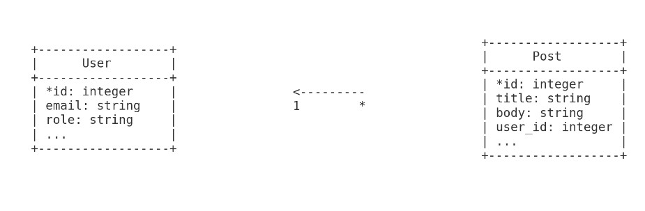

# Ruby on Rails CRUD with Devise & Pundit

#### Build Docker Image:
```
docker compose build
```

#### Running Docker Container:

```
docker compose up
```

#### Create database & database migrate & seed database:

```
docker exec rails bash -c 'rails db:create && rails db:migrate && rails db:seed'
```
#### DB Config:

```
database: development.sqlite3
```
#### Feature:
* User can regiser/login/logout
* User can see their post listing (all/single)
* User can add/edit/delete their post(s)
* Admin can see all post listing (all/single)
* Admin can add/edit/delete their post(s)

#### DB ERD Diagram:


#### Technical Details:
* Devise to manage authentication
* Pundit to manage authorization

#### Run individual database seeder:

##### Users seeder:
```
docker exec rails bash -c 'rails runner db/seeds/users.rb'
```
##### Posts seeder:
```
docker exec rails bash -c 'rails runner db/seeds/posts.rb
```